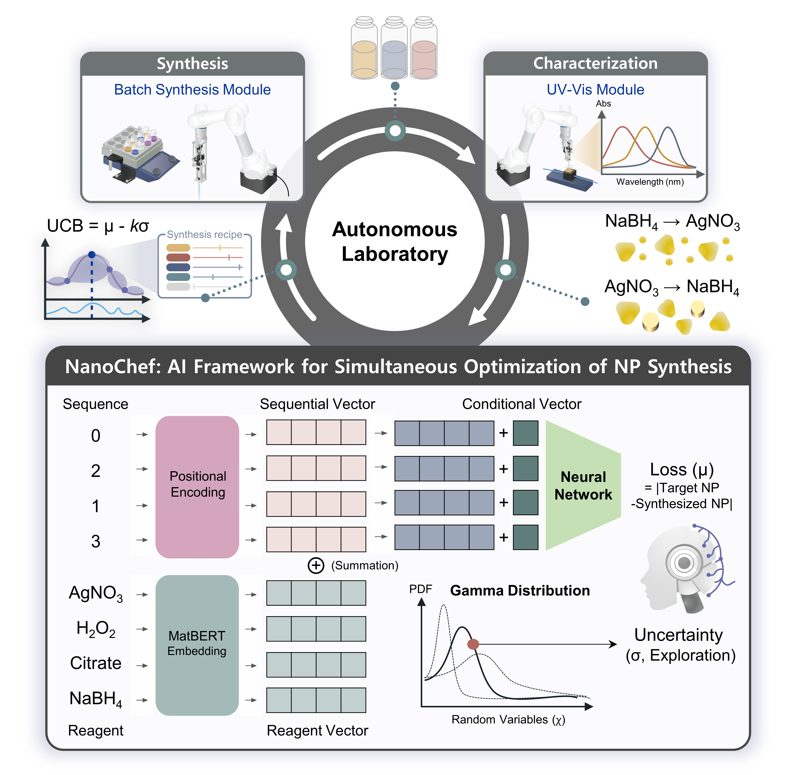

# NanoChef: AI Framework for Simultaneous Optimization of Synthesis Sequences and Reaction Conditions at Autonomous Laboratories

<p align="center">
  
</p>

<i>**NanoChef**</i> is an AI framework for virtual experimentation and autonomous materials discovery. With support for MatBERT embeddings, neural surrogate modeling, and high-throughput virtual experiments, <i>**NanoChef**</i> enables intelligent synthesis exploration of complex design spaces via synthesis order and reaction conditions optimization. Whether you're optimizing synthesis conditions or testing surrogate models, <i>**NanoChef**</i> provides a modular and extensible platform for scientific automation.

---

## 📦 Installation

### Requirements

- Python 3.9+
- See `requirements.txt` for full dependency list.

### NanoChef Setup

```bash
git clone https://github.com/KIST-CSRC/NanoChef.git
cd NanoChef
conda create -n NanoChef python=3.9
conda activate NanoChef
pip install -r requirements.txt
```
Windows users can install using .bat file, as below:

```bash
install_package_with_git.bat
```

### [MatBERT<sup>2</sup>](https://github.com/lbnlp/MatBERT) Setup

We tried to generate reagent vector using MatBERT, pretrained model.

To use MatBERT, download these files into a folder:

```
export MODEL_PATH="Your path"
mkdir $MODEL_PATH/matbert-base-cased $MODEL_PATH/matbert-base-uncased

curl -# -o $MODEL_PATH/matbert-base-cased/config.json https://cedergroup-share.s3-us-west-2.amazonaws.com/public/MatBERT/model_2Mpapers_cased_30522_wd/config.json
curl -# -o $MODEL_PATH/matbert-base-cased/vocab.txt https://cedergroup-share.s3-us-west-2.amazonaws.com/public/MatBERT/model_2Mpapers_cased_30522_wd/vocab.txt
curl -# -o $MODEL_PATH/matbert-base-cased/pytorch_model.bin https://cedergroup-share.s3-us-west-2.amazonaws.com/public/MatBERT/model_2Mpapers_cased_30522_wd/pytorch_model.bin

curl -# -o $MODEL_PATH/matbert-base-uncased/config.json https://cedergroup-share.s3-us-west-2.amazonaws.com/public/MatBERT/model_2Mpapers_uncased_30522_wd/config.json
curl -# -o $MODEL_PATH/matbert-base-uncased/vocab.txt https://cedergroup-share.s3-us-west-2.amazonaws.com/public/MatBERT/model_2Mpapers_uncased_30522_wd/vocab.txt
curl -# -o $MODEL_PATH/matbert-base-uncased/pytorch_model.bin https://cedergroup-share.s3-us-west-2.amazonaws.com/public/MatBERT/model_2Mpapers_uncased_30522_wd/pytorch_model.bin
```

Then some folder will generate, as below.
```text
NanoChef/
...
├── matbert-base-cased/
├── matbert-base-uncased/
...
```

### [Olympus<sup>3</sup>](https://github.com/aspuru-guzik-group/olympus) Setup

Our virtual experiments was based on Olympus environments, diverse and many virtual spaces.

``Olympus`` can be installed with ``pip``:

```
pip install olymp
```

The package can also be installed via ``conda``:

```
conda install -c conda-forge olymp
```

Finally, the package can be built from source:

``` 
git clone https://github.com/aspuru-guzik-group/olympus.git
cd olympus
python setup.py develop
```

Then some folder will generate, as below.
```text
NanoChef/
...
├── case_studies/
├── cifar/
├── docs/
├── examples/
├── my_new_emulator/
├── src/
...
```

---

## 🚀 Quick Start of Virtual Experiments

### Generate a Job Script

The following table describes the configuration keys used in the virtual experiment JSON config file:

| Key              | Description                                                               |
|:-----------------|:--------------------------------------------------------------------------|
| subject          | Name or label of the virtual experiment run.                              |
| description      | Optional description or notes about the run.                              |
| log_level        | Verbosity of logging (e.g., DEBUG, INFO, WARNING).                        |
| model_name       | Name of the model used (e.g., NN+Gamma).                                  |
| total_surfaces   | List of benchmark functions to be optimized (e.g., ` [["Dejong", "HyperEllipsoid"], ["Dejong", "Denali"]]`).                              |
| num_variables    | Number of input continuous variables (dimensions of the continuous variables).               |
| initial_n_sample | Number of initial random samples before active learning begins.             |
| n_points         | Number of points to be divided range of each variables. (e.g. `n_points=101`, 100 grids in each variables)         |
| batch_size       | Number of samples selected in each batch.                                 |
| ps_dim           | Dimension of the positional encoding (e.g. `ps_dim=4`, each sequential vecotr is 4-dimensaionl vector).                                         |
| output_dim       | Output dimension of the prediction (usually 1 for scalar loss).        |
| nn_n_hidden      | Number of hidden neuron size in the neural network.                             |
| kappa_list       | List of exploration-exploitation trade-off parameters (UCB (Upper Confidence Bounds) kappa values). |
| seed_num         | Random seed for reproducibility.                                          |
| reagent_list     | List of chemical reagents to be used in the virtual experiment.           |
| rgn_vec_onoff    | Boolean flag to enable or disable reagent vector from MatBERT pretrained model.                   |
| n_search_epochs  | Number of active search (optimization) iterations.                        |
| n_train_epochs   | Number of epochs for training the surrogate model.                        |
| lr               | Learning rate for training the neural network.                            |
| patience         | Number of epochs to wait before early stopping if no improvement.         |

### Run Examples

- cpu version
```bash
python virtual_experiments.py --path config/20250628/test.json --cuda cpu
```
- gpu version
```bash
python virtual_experiments.py --path config/20250628/test.json --cuda cuda:0
```
---

## 📁 Project Structure

```text
NanoChef/
├── BaseUtils/
├── case_studies/
├── cifar/
├── config/
├── docs/
├── examples/
├── Log/
├── matbert-base-cased/
├── matbert-base-uncased/
├── my_new_emulator/
├── Sequence/
├── src/
├── install_package_with_git.bat
├── latin_hypercube_sampling_test.py
├── NanoChefModule.py
├── module_node.py
├── requirements.txt
├── virtual_experiments.py
├── virtual_space_image.py
├── virtual_test/
├── visualization_data.py
└── README.md
```

---

## 🔧 Key Modules

- `NanoChefModule.py`: AI unit for recipe recommendations in real chemical experiments
- `module_node.py`: Module for real chemical experiments, connected with [OCTOPUS<sup>4<sup>](https://github.com/KIST-CSRC/Octopus)
- `Sequence`: Contains architecture of NanoChef
- `virtual_experiments.py`: Closed-loop virtual experiment simulation
- `virtual_space_image.py`: Visualization of latent variable space

---

## 📊 Visualization

### Visualization of Virtual Spaces
You can generate to visualize virtual spaces using:

```bash
python virtual_space_image.py
```

This images of virtual space and spearman coefficient values of virtual space combinations can help to organize virtual space combinations for virtual experiments.

### Visualization of the Performance of Virtual Experiments
You can visualize outputs of virtual experiments.
```bash
python visualization_data.py
```

- def visualization_model_performance
- def visualization_scatter
- def create_gif
---

## 🚀 Quick Start of Real Chemcial Experiments

### Activate Module Node of NanoChef

```bash
python module_node.py
```

### Activate [OCTOPUS<sup>4<sup>](https://github.com/KIST-CSRC/Octopus)

```bash
python master_node.py
```

### Login/Submit Job Script via OCTOPUS

```bash
qsub {jobscript_dirpath}/{jobscript_name} real
```
---

## 🙋 Author

Developed by [Hyuk Jun Yoo](mailto:hyukjunus@gmail.com) at Korea Institute of Science and Technology (KIST)

---

## 🙏 Acknowledgments

- [MatBERT](https://github.com/materialsintelligence/matbert) for pretrained materials-aware BERT models  
- [Olympus](https://github.com/aspuru-guzik-group/olympus) for providing virtual spaces of virtual experiments
- [OCTOPUS](https://github.com/KIST-CSRC/Octopus) for orchestrating module node as central management system

## Reference
For more details, see the paper below.
Please cite us if you are using our model in your research work: <br />

  [1] 	[Hyuk Jun. Yoo., et al. "NanoChef: AI Framework for Simultaneous Optimization of Synthesis Sequences and Reaction Conditions in Autonomous Laboratories" ChemRxiv (2025).](https://chemrxiv.org/engage/chemrxiv/article-details/685bb51d3ba0887c337fc094)
  
  [2] 	[Trewartha, Amalie, et al. "Quantifying the advantage of domain-specific pre-training on named entity recognition tasks in materials science." Patterns 3.4 (2022).](https://www.cell.com/patterns/fulltext/S2666-3899(22)00073-3)
  
  [3] 	[Häse, Florian, et al. "Olympus: a benchmarking framework for noisy optimization and experiment planning." Machine Learning: Science and Technology 2.3 (2021): 035021.](https://iopscience.iop.org/article/10.1088/2632-2153/abedc8/meta)

  [4] 	[Yoo, Hyuk Jun, et al. "OCTOPUS: operation control system for task optimization and job parallelization via a user-optimal scheduler." Nature communications 15.1 (2024): 9669.](https://www.nature.com/articles/s41467-024-54067-7)